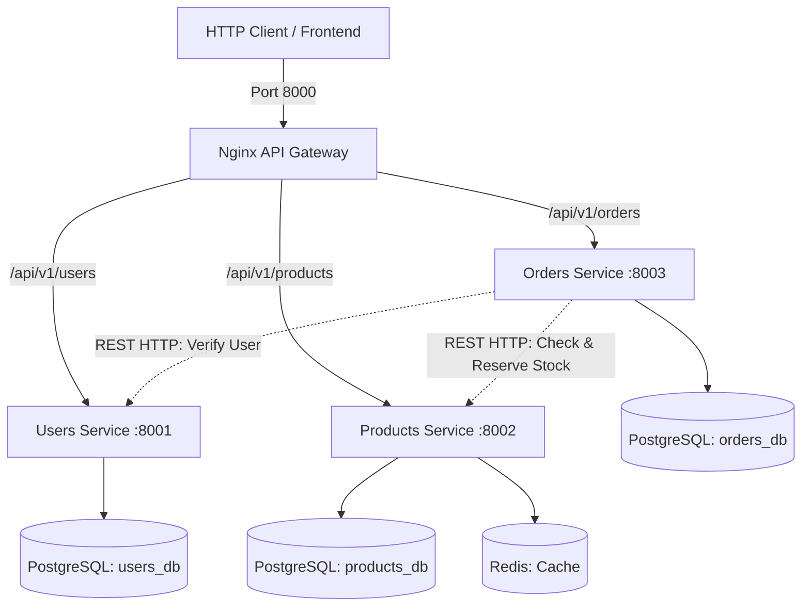

# DevOps Platform — Microservices Architecture

Цей проєкт розроблений для лабораторних робіт та практичних завдань з курсу **DevOps**.
Він реалізований за принципом **Microservices Architecture (Database per Service)** з автономними сервісами, власними базами даних, ізольованими Dockerfile та єдиною точкою входу через **Nginx API Gateway**.

---

## 🛠 Технологічний стек

- **Мова програмування:** Python 3.12+
- **Менеджер пакетів та віртуального середовища:** [uv](https://github.com/astral-sh/uv)
- **Веб-фреймворк:** [FastAPI](https://fastapi.tiangolo.com/) + Pydantic v2
- **ORM / База даних:** [SQLAlchemy 2.0](https://www.sqlalchemy.org/) (Asyncio) + PostgreSQL 16 (`asyncpg`)
- **Міграції:** [Alembic](https://alembic.sqlalchemy.org/) (Async) окремо для кожного сервісу
- **Міжсервісна взаємодія:** REST HTTP клієнти (`httpx`)
- **API Gateway:** Nginx Reverse Proxy (порт 8000)
- **Кеш / Брокер:** Redis 7
- **Логування:** [Loguru](https://github.com/Delgan/loguru) зі структурованим перехопленням логів
- **Лінтери та типізація:** Ruff, Mypy
- **Тестування:** Pytest (Unit, Integration, API/E2E з підтримкою асинхронності та mock-клієнтів)
- **Контейнеризація:** Multi-stage Dockerfile на базі `uv` + Docker Compose

---

## 🏛 Архітектура сервісів

| Сервіс | Порт | База даних | Опис відповідальності |
| :--- | :--- | :--- | :--- |
| **API Gateway** | `8000` | — | Nginx reverse proxy, маршрутизація запитів на сервіси |
| **Users Service** | `8001` | `users_db` | Управління користувачами, статусами активності, профілями |
| **Products Service** | `8002` | `products_db` | Каталог товарів, ціни, резервування та списання залишків на складі |
| **Orders Service** | `8003` | `orders_db` | Управління замовленнями, координація з Users та Products через REST |



---

## 📂 Структура проєкту

```text
.
├── gateway/
│   └── nginx.conf                # Конфігурація Nginx API Gateway (порт 8000)
├── services/
│   ├── users/                    # Мікросервіс користувачів (порт 8001)
│   │   ├── pyproject.toml
│   │   ├── Dockerfile
│   │   ├── alembic.ini & alembic/
│   │   ├── src/ (main, router, service, repository, models, schemas, seed)
│   │   └── tests/ (unit, integration, api)
│   ├── products/                 # Мікросервіс товарів (порт 8002)
│   │   ├── pyproject.toml
│   │   ├── Dockerfile
│   │   ├── alembic.ini & alembic/
│   │   ├── src/ (main, router, service, repository, models, schemas, seed)
│   │   └── tests/ (unit, integration, api)
│   └── orders/                   # Мікросервіс замовлень (порт 8003)
│       ├── pyproject.toml
│       ├── Dockerfile
│       ├── alembic.ini & alembic/
│       ├── src/ (main, router, service, repository, models, schemas, clients)
│       └── tests/ (unit, integration, api)
├── scripts/
│   ├── init-multiple-dbs.sh      # Ініціалізація баз даних users_db, products_db, orders_db
│   └── pg_backup_rotated.sh      # Ротаційний бекап усіх мікросервісних БД
├── docker-compose.yml            # Оркестрація всіх сервісів
├── .env.example                  # Шаблон змінних середовища
├── .env                          # Локальний файл змінних середовища
├── .gitignore
└── README.md
```

---

## 🚀 Швидкий старт (Локальна розробка через uv)

### 1. Перевірка та тести для кожного сервісу

```bash
# Users Service
cd services/users
uv run pytest -v
uv run ruff check .
uv run mypy .

# Products Service
cd ../products
uv run pytest -v
uv run ruff check .
uv run mypy .

# Orders Service
cd ../orders
uv run pytest -v
uv run ruff check .
uv run mypy .
```

---

## 🐳 Запуск через Docker Compose

```bash
# Запуск усієї інфраструктури (Postgres, Redis, 3 сервіси, Nginx Gateway, Backup)
docker compose up -d --build

# Перевірка статусу контейнерів
docker compose ps

# Перегляд логів
docker compose logs -f gateway
docker compose logs -f orders

# Зупинка
docker compose down
```

### Ендпоінти через API Gateway (порт 8000):
- **Gateway Health:** `http://localhost:8000/health`
- **Users API:** `http://localhost:8000/api/v1/users`
- **Products API:** `http://localhost:8000/api/v1/products`
- **Orders API:** `http://localhost:8000/api/v1/orders`

Прямий доступ до сервісів:
- Users Service: `http://localhost:8001/docs`
- Products Service: `http://localhost:8002/docs`
- Orders Service: `http://localhost:8003/docs`
