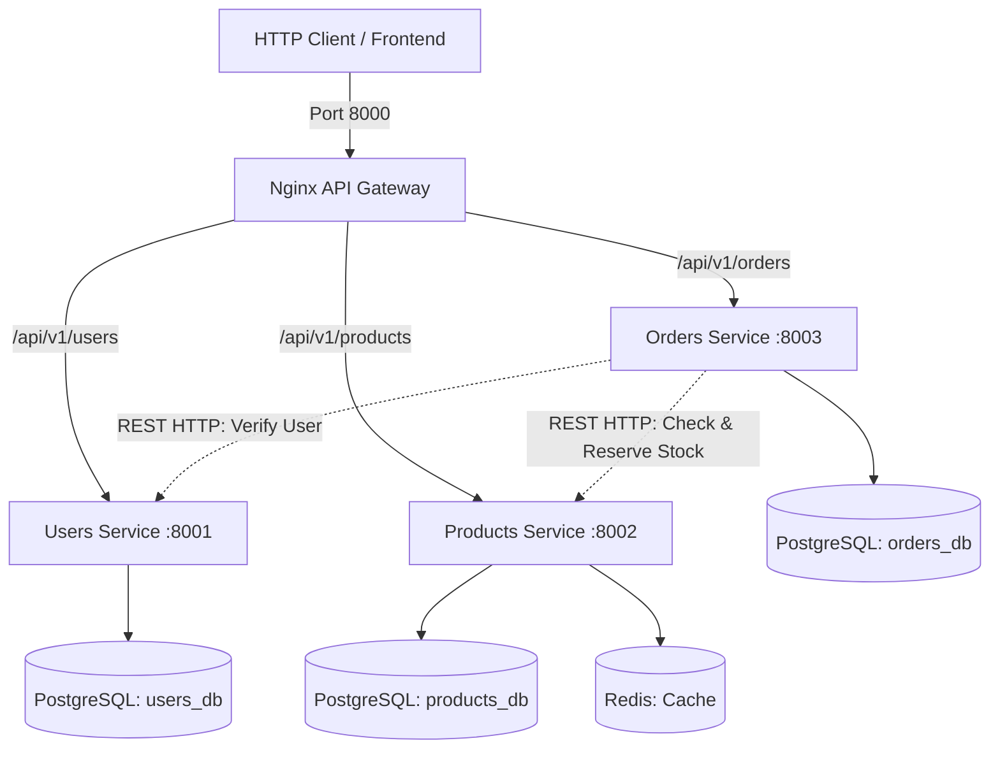

# DevOps Platform — Microservices Architecture

Цей проєкт розроблений для лабораторних робіт та практичних завдань з курсу **DevOps**.
Він реалізований за принципом **Microservices Architecture (Database per Service)** з автономними сервісами, власними базами даних, ізольованими Dockerfile та єдиною точкою входу через **Nginx API Gateway**.

---

## 🛠 Технологічний стек

- **Мова програмування:** Python 3.12+
- **Менеджер пакетів та віртуального середовища:** [uv](https://github.com/astral-sh/uv)
- **Веб-фреймворк:** [FastAPI](https://fastapi.tiangolo.com/) + Pydantic v2
- **ORM / База даних:** [SQLAlchemy 2.0](https://www.sqlalchemy.org/) (Asyncio) + PostgreSQL 16 (`asyncpg`)
- **Міграції:** [Alembic](https://alembic.sqlalchemy.org/) (Async) окремо для кожного сервісу
- **Міжсервісна взаємодія:** REST HTTP клієнти (`httpx`)
- **API Gateway:** Nginx Reverse Proxy (порт 8000)
- **Кеш / Брокер:** Redis 7
- **Логування:** [Loguru](https://github.com/Delgan/loguru) зі структурованим перехопленням логів
- **Лінтери та типізація:** Ruff, Mypy
- **Тестування:** Pytest (Unit, Integration, API/E2E з підтримкою асинхронності та mock-клієнтів)
- **Контейнеризація:** Multi-stage Dockerfile на базі `uv` + Docker Compose

---

## 🏛 Архітектура сервісів

| Сервіс | Порт | База даних | Опис відповідальності |
| :--- | :--- | :--- | :--- |
| **API Gateway** | `8000` | — | Nginx reverse proxy, маршрутизація запитів на сервіси |
| **Users Service** | `8001` | `users_db` | Управління користувачами, статусами активності, профілями |
| **Products Service** | `8002` | `products_db` | Каталог товарів, ціни, резервування та списання залишків на складі |
| **Orders Service** | `8003` | `orders_db` | Управління замовленнями, координація з Users та Products через REST |


```mermaid
graph TD
    Client[HTTP Client / Frontend] -->|Port 8000| Gateway[Nginx API Gateway]

    Gateway -->|/api/v1/users| UsersSvc[Users Service :8001]
    Gateway -->|/api/v1/products| ProductsSvc[Products Service :8002]
    Gateway -->|/api/v1/orders| OrdersSvc[Orders Service :8003]

    OrdersSvc -.->|REST HTTP: Verify User| UsersSvc
    OrdersSvc -.->|REST HTTP: Check & Reserve Stock| ProductsSvc

    UsersSvc --> DB_Users[(PostgreSQL: users_db)]
    ProductsSvc --> DB_Products[(PostgreSQL: products_db)]
    OrdersSvc --> DB_Orders[(PostgreSQL: orders_db)]

    ProductsSvc --> Redis[(Redis: Cache)]
```

---

## 📂 Структура проєкту

```text
.
├── gateway/
│   └── nginx.conf                # Конфігурація Nginx API Gateway (порт 8000)
├── services/
│   ├── users/                    # Мікросервіс користувачів (порт 8001)
│   │   ├── pyproject.toml
│   │   ├── Dockerfile
│   │   ├── alembic.ini & alembic/
│   │   ├── src/ (main, router, service, repository, models, schemas, seed)
│   │   └── tests/ (unit, integration, api)
│   ├── products/                 # Мікросервіс товарів (порт 8002)
│   │   ├── pyproject.toml
│   │   ├── Dockerfile
│   │   ├── alembic.ini & alembic/
│   │   ├── src/ (main, router, service, repository, models, schemas, seed)
│   │   └── tests/ (unit, integration, api)
│   └── orders/                   # Мікросервіс замовлень (порт 8003)
│       ├── pyproject.toml
│       ├── Dockerfile
│       ├── alembic.ini & alembic/
│       ├── src/ (main, router, service, repository, models, schemas, clients)
│       └── tests/ (unit, integration, api)
├── scripts/
│   ├── init-multiple-dbs.sh      # Ініціалізація баз даних users_db, products_db, orders_db
│   └── pg_backup_rotated.sh      # Ротаційний бекап усіх мікросервісних БД
├── docker-compose.yml            # Оркестрація всіх сервісів
├── .env.example                  # Шаблон змінних середовища
├── .env                          # Локальний файл змінних середовища
├── .gitignore
└── README.md
```

---

## 🚀 Швидкий старт (Локальна розробка через uv)

### 1. Перевірка та тести для кожного сервісу

```bash
# Users Service
cd services/users
uv run pytest -v
uv run ruff check .
uv run mypy .

# Products Service
cd ../products
uv run pytest -v
uv run ruff check .
uv run mypy .

# Orders Service
cd ../orders
uv run pytest -v
uv run ruff check .
uv run mypy .
```

---

## 🐳 Запуск через Docker Compose

```bash
# Запуск усієї інфраструктури (Postgres, Redis, 3 сервіси, Nginx Gateway, Backup)
docker compose up -d --build

# Перевірка статусу контейнерів
docker compose ps

# Перегляд логів
docker compose logs -f gateway
docker compose logs -f orders

# Зупинка
docker compose down
```

### Ендпоінти через API Gateway (порт 8000):
- **Gateway Health:** `http://localhost:8000/health`
- **Users API:** `http://localhost:8000/api/v1/users`
- **Products API:** `http://localhost:8000/api/v1/products`
- **Orders API:** `http://localhost:8000/api/v1/orders`

Прямий доступ до сервісів:
- Users Service: `http://localhost:8001/docs`
- Products Service: `http://localhost:8002/docs`
- Orders Service: `http://localhost:8003/docs`

---

## ☸️ Розгортання в Kubernetes (Lab 3)

Проєкт адаптовано для декларативного розгортання в Kubernetes-кластері (наприклад, [Minikube](https://minikube.sigs.k8s.io/)) з використанням маніфестів у каталозі `k8s/`.

### 1. Передумови (Prerequisites)
- **Docker** 24+
- **Minikube** v1.30+
- **kubectl** v1.28+

Запуск кластера Minikube та активація необхідних доповнень (Ingress, Metrics Server):
```bash
# Запуск кластера з драйвером docker
minikube start --driver=docker

# Активація доповнень
minikube addons enable ingress
minikube addons enable metrics-server
```

### 2. Розгортання однією командою (Single-command deployment)

Усі маніфести організовані в каталозі `k8s/`. Для розгортання всієї інфраструктури (Namespace, Stateful-сховища, Microservices, API Gateway, Ingress) виконайте:

```bash
# Створення ізольованого namespace та рекурсивне застосування всіх маніфестів:
kubectl apply -f k8s/00-namespace.yaml && kubectl apply -R -f k8s/
```

Перевірка статусу розгорнутих компонентів:
```bash
kubectl get all,pvc,ingress -n devops-lab3
```

### 3. Таблиця параметрів конфігурації (ConfigMap та Secret)

| Сервіс / Ресурс | Тип об'єкта | Назва в K8s | Параметр (Ключ) | Опис та призначення |
| :--- | :--- | :--- | :--- | :--- |
| **Users Service** | `ConfigMap` | `users-config` | `APP_CONFIG__ENVIRONMENT` | Середовище виконання (`k8s`) |
| | | | `APP_CONFIG__LOG__LEVEL` | Рівень деталізації логів (`INFO`) |
| | | | `APP_CONFIG__DB__HOST` | DNS-хост сервісу PostgreSQL (`postgres`) |
| | | | `APP_CONFIG__DB__PORT` | Порт PostgreSQL (`5432`) |
| | | | `APP_CONFIG__DB__NAME` | Назва бази даних мікросервісу (`users_db`) |
| | | | `APP_CONFIG__DB__USER` | Користувач БД (`devops_user`) |
| | | | `APP_CONFIG__REDIS__HOST` | DNS-хост кешу Redis (`redis`) |
| | | | `APP_CONFIG__REDIS__PORT` | Порт Redis (`6379`) |
| | | | `HTTP_PORT` | Порт запуску застосунку (`8001`) |
| | `Secret` | `users-secret` | `APP_CONFIG__DB__PASSWORD` | Пароль доступу до бази даних |
| | | | `APP_CONFIG__REDIS__PASSWORD` | Пароль доступу до Redis |
| | | | `APP_CONFIG__AUTH__ACCESS_SECRET_KEY` | Секретний ключ для підпису JWT токенів |
| **Products Service** | `ConfigMap` | `products-config` | `APP_CONFIG__ENVIRONMENT` | Середовище виконання (`k8s`) |
| | | | `APP_CONFIG__LOG__LEVEL` | Рівень логів (`INFO`) |
| | | | `APP_CONFIG__DB__HOST` / `PORT` | Адресація бази даних (`postgres:5432`) |
| | | | `APP_CONFIG__DB__NAME` | Назва бази даних (`products_db`) |
| | | | `APP_CONFIG__DB__USER` | Користувач БД (`devops_user`) |
| | | | `APP_CONFIG__REDIS__HOST` / `PORT` | Адресація кешу (`redis:6379`) |
| | | | `HTTP_PORT` | Порт запуску застосунку (`8002`) |
| | `Secret` | `products-secret` | `APP_CONFIG__DB__PASSWORD` | Пароль доступу до бази даних |
| | | | `APP_CONFIG__REDIS__PASSWORD` | Пароль доступу до Redis |
| **Orders Service** | `ConfigMap` | `orders-config` | `APP_CONFIG__ENVIRONMENT` | Середовище виконання (`k8s`) |
| | | | `APP_CONFIG__LOG__LEVEL` | Рівень логів (`INFO`) |
| | | | `APP_CONFIG__DB__HOST` / `PORT` | Адресація бази даних (`postgres:5432`) |
| | | | `APP_CONFIG__DB__NAME` | Назва бази даних (`orders_db`) |
| | | | `APP_CONFIG__DB__USER` | Користувач БД (`devops_user`) |
| | | | `APP_CONFIG__SERVICES__USERS_URL` | Внутрішній URL сервісу користувачів (`http://users:8001`) |
| | | | `APP_CONFIG__SERVICES__PRODUCTS_URL` | Внутрішній URL сервісу товарів (`http://products:8002`) |
| | | | `HTTP_PORT` | Порт запуску застосунку (`8003`) |
| | `Secret` | `orders-secret` | `APP_CONFIG__DB__PASSWORD` | Пароль доступу до бази даних |
| **PostgreSQL** | `ConfigMap` | `postgres-initdb` | `init-multiple-dbs.sh` | Shell-скрипт ініціалізації автономних БД (`users_db`, `products_db`, `orders_db`) |
| | `Secret` | `postgres-secret` | `POSTGRES_USER` | Адміністратор PostgreSQL (`devops_user`) |
| | | | `POSTGRES_PASSWORD` | Пароль доступу до PostgreSQL |
| | | | `POSTGRES_DB` | Базова системна БД (`devops_db`) |
| | | | `POSTGRES_MULTIPLE_DATABASES` | Список баз даних для ініціалізації |
| | | | `POSTGRES_INITDB_ARGS` | Кодування та локаль (`--encoding=UTF-8 ...`) |
| **API Gateway** | `ConfigMap` | `gateway-config` | `nginx.conf` | Конфігурація Nginx, правила upstream та маршрутизація запитів |

### 4. Інструкція з доступу до застосунку (Access instructions)

Отримати IP-адресу кластера Minikube:
```bash
minikube ip
# За замовчуванням: 192.168.49.2
```

#### Спосіб 1: Через NodePort (Порт 30080)
Доступний безпосередньо з хостової машини за адресою:
- **API Gateway Health:** `http://<minikube-ip>:30080/health`
- **Users Service API:** `http://<minikube-ip>:30080/api/v1/users/health`
- **Products Service API:** `http://<minikube-ip>:30080/api/v1/products/health`
- **Orders Service API:** `http://<minikube-ip>:30080/api/v1/orders/health`

#### Спосіб 2: Через Kubernetes Ingress (`devops.local`)
1. Додайте запис до файлу `/etc/hosts`:
```bash
echo "$(minikube ip) devops.local" | sudo tee -a /etc/hosts
```
2. Виконуйте запити на домен `http://devops.local`:
```bash
curl http://devops.local/health
curl http://devops.local/api/v1/users/health
curl http://devops.local/api/v1/products/health
curl http://devops.local/api/v1/orders/health
```

### 5. Очищення ресурсів (Cleanup)

Для повного видалення всіх створених ресурсів та простору імен виконайте:
```bash
kubectl delete -f k8s/00-namespace.yaml
```
Або покрокове видалення об'єктів:
```bash
kubectl delete -R -f k8s/
```
